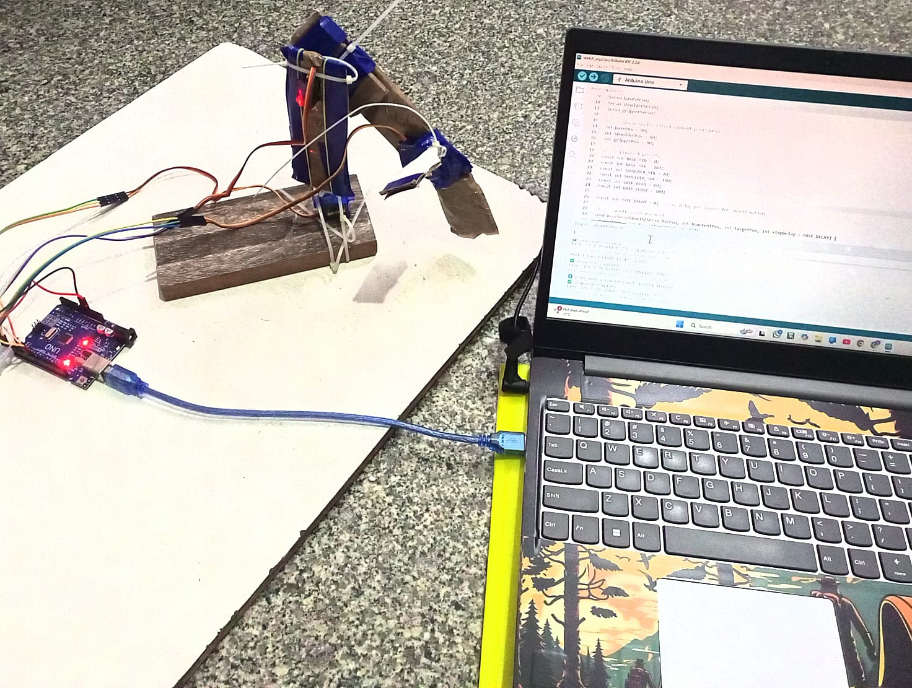
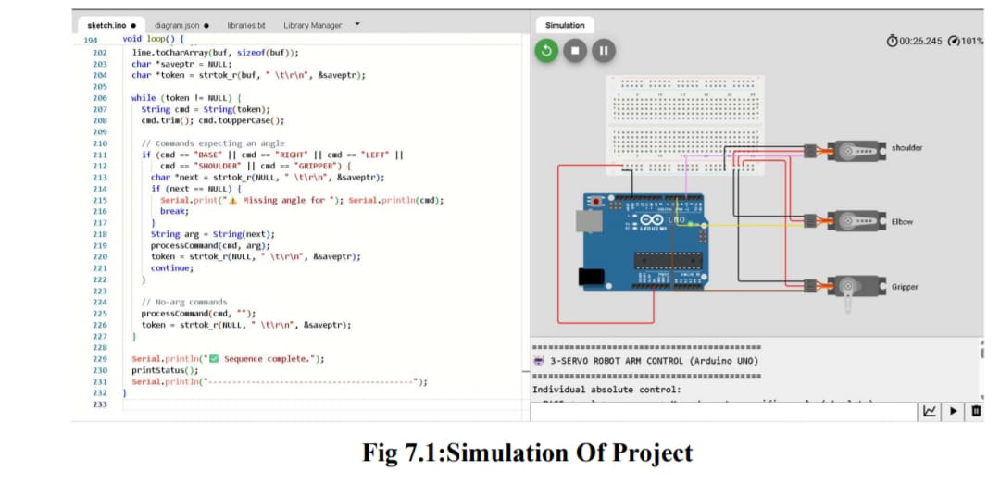
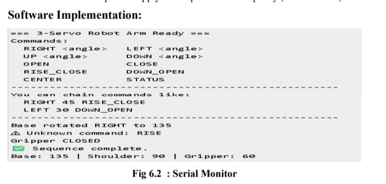

# 🤖 3DOF Robotic Manipulator using Arduino UNO

> Arduino-based 3-DOF robotic manipulator featuring smooth PWM servo control, serial command interface, coordinated macro movements, and Wokwi simulation.

---

## 📌 Overview

This project presents a low-cost 3-DOF robotic manipulator controlled by an Arduino UNO using PWM-driven servo motors. It supports smooth servo motion, serial command-based control, and predefined macro movements. The project is designed for robotics education, embedded systems learning, and rapid prototyping.

---

## ✨ Features

- 3-DOF Robotic Arm
- Arduino UNO based implementation
- PWM Servo Motor Control
- Smooth Motion Algorithm
- Serial Command Interface
- Relative & Absolute Motion Control
- Macro Commands
- Wokwi Simulation Support
- Beginner Friendly

---

## 🛠 Hardware Used

| Component | Quantity |
|-----------|---------:|
| Arduino UNO | 1 |
| SG90 Servo Motor | 3 |
| Breadboard | 1 |
| Jumper Wires | As Required |
| USB Cable | 1 |

---

## 💻 Software Used

- Arduino IDE
- Servo Library
- Wokwi Simulator

---

## 📂 Repository Structure

```text
3DOF-Robotic-Manipulator-Arduino
│
├── Arduino_Code
│   └── RoboticManipulator.ino
│
├── Documentation
│   └── Project_Report.pdf
│
├── Images
│   ├── Hardware_Setup.jpg
│   ├── Connection_Diagram.jpg
│   ├── Wokwi_Simulation.jpg
│   ├── Serial_Monitor.jpg
│   └── Project_Demo.mp4
│
└── README.md
```

---

## ⚙️ Pin Configuration

| Servo | Arduino Pin |
|--------|------------:|
| Base Servo | D3 |
| Shoulder Servo | D5 |
| Gripper Servo | D6 |

---

## 🚀 Supported Commands

```text
BASE <angle>

SHOULDER <angle>

GRIPPER <angle>

RIGHT <angle>

LEFT <angle>

OPEN

CLOSE

CENTER

STATUS

RISE_CLOSE

RISE_OPEN

DOWN_CLOSE

DOWN_OPEN
```

---

## ▶️ How to Run

1. Clone this repository.

```bash
git clone https://github.com/challachaithanyareddy/3DOF-Robotic-Manipulator-Arduino.git
```

2. Open

```
Arduino_Code/RoboticManipulator.ino
```

3. Select

```
Board → Arduino UNO
```

4. Upload the code.

5. Open the Serial Monitor.

6. Send commands like

```text
BASE 90
RIGHT 45
OPEN
STATUS
```

---

## 📸 Project Images

### Hardware Setup



### Connection Diagram


### Wokwi Simulation



### Serial Monitor Output



---

## 🎥 Project Demonstration

Project demonstration video is available in the **Images** folder as:

```🎥 [Download / Watch Demo](Images/functioning.mp4)
```

---

## 📈 Future Improvements

- ESP32 Wi-Fi Control
- Bluetooth App Control
- Computer Vision Integration
- Object Detection
- Inverse Kinematics
- ROS Support
- Voice Control

---

## 📚 Applications

- Robotics Education
- Embedded Systems
- Automation
- Laboratory Demonstration
- Servo Motor Experiments
- Academic Projects

---

## 👨‍💻 Author

**Chaithanya Reddy Challa**

Electronics and Communication Engineering

GitHub:
https://github.com/challachaithanyareddy

---
## 📄 License

This project is released under the MIT License.

You are free to use, modify, and distribute this project provided that the original copyright notice and license are included.

For more information, see the [LICENSE](LICENSE) file.

⭐ If you found this project useful, consider giving it a star.
